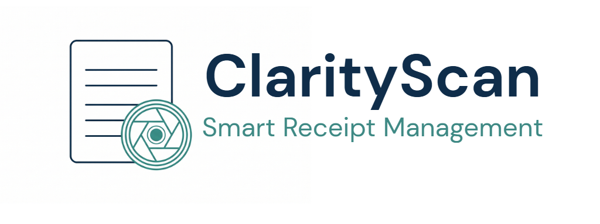
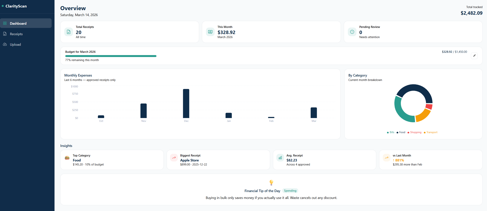
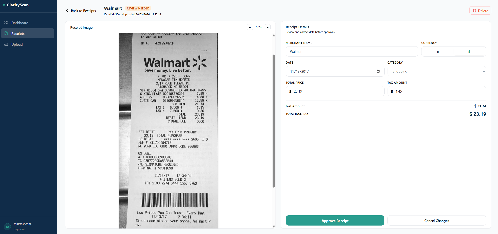
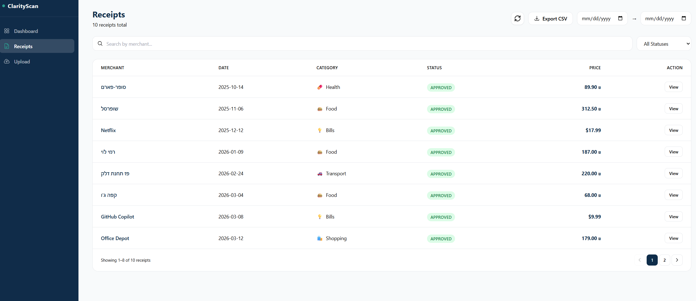
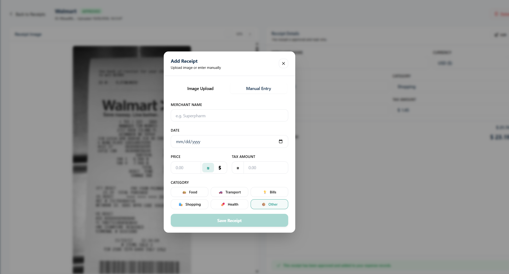

<div align="center">



### AI-Powered Receipt Management — OCR · Computer Vision · Expense Analytics

[](https://python.org)
[](https://fastapi.tiangolo.com)
[](https://react.dev)
[](https://postgresql.org)
[](https://docker.com)
[](https://github.com/features/actions)
[](LICENSE)

</div>

---

## Overview

ClarityScan is a production-grade fullstack SaaS application that turns a receipt photo into structured, searchable financial data — automatically.

Point your camera at a receipt → **OpenCV** preprocesses the image → **EasyOCR** extracts the text → the AI pipeline parses merchant, amount, date, and category → the data lands in your expense dashboard, ready for tracking, analysis, and CSV export. If the AI makes a mistake, users review and correct it before final approval. The entire pipeline is async and non-blocking.

---

## Technical Highlights

**Non-Blocking OCR Pipeline**  
Upload requests return `202 Accepted` immediately. OCR runs as a FastAPI `BackgroundTask` — the server never blocks on processing. Receipts move through a typed finite state machine enforced at the database level:

```
UPLOADED → PROCESSING → REVIEW_NEEDED → APPROVED
                                      ↘ FAILED
```

**Computer Vision Preprocessing**  
Raw receipt photos are poor OCR input. Before EasyOCR sees a single character, OpenCV runs a multi-step preprocessing pipeline: Gaussian blur → Otsu thresholding → contour detection → perspective correction via 4-corner homography. This step is what makes OCR on real-world, skewed, low-light photos reliable.

| Step | Technique |
|---|---|
| Noise reduction | Gaussian blur |
| Binarization | Otsu thresholding |
| Receipt boundary detection | Contour approximation |
| Deskew & crop | 4-point perspective transform |

**OCR Intelligence**  
After text extraction, the pipeline applies several parsing layers before storing any data:
- **Confidence filtering** — OCR results below 0.3 confidence are discarded before parsing
- **Multi-locale price parsing** — handles both `1,234.56` (US) and `1.234,56` (European) decimal formats
- **Multi-format date parsing** — tries 6 date formats (`%m/%d/%y`, `%d/%m/%Y`, `%Y-%m-%d`, and more) until one succeeds
- **Tax auto-calculation** — tax is derived automatically as `total − subtotal` from the receipt; users never need to enter it manually

**JWT Authentication**  
Stateless JWT-based auth using `python-jose`. Passwords hashed with Argon2/Bcrypt via `passlib`. Every protected endpoint validates the token and scopes the query to the authenticated user — cross-user data access is impossible at the database layer.

**Secure File Upload**  
Uploaded files are validated using `python-magic` — the server reads the first 2048 bytes and checks the actual MIME type, not just the filename extension. This prevents disguised file uploads (e.g. renaming `malware.exe` → `receipt.jpg`). Files are then written to disk non-blocking via `aiofiles`, keeping the upload handler fully async.

**Financial Data Precision**  
All monetary values are stored as `Numeric(10, 2)` (PostgreSQL `DECIMAL`) — never `float`. Floating-point arithmetic is unsuitable for financial data; `Decimal` guarantees exact representation to the cent.


All database operations use `AsyncSession` — no thread blocking anywhere in the stack. Schema migrations managed with Alembic, with a full version history from initial schema through feature additions.

**Rate Limiting**  
Login endpoint protected with `slowapi` rate limiting (5 requests/minute per IP) to prevent brute force attacks.

**Code Quality & CI**  
`ruff` enforces linting and formatting across all Python code. A GitHub Actions workflow runs `ruff check .` on every push and PR to `main` — the pipeline fails on any linting error, keeping the codebase clean and PEP8-compliant.

---

## Stack

| Layer | Technology |
|---|---|
| Backend | Python 3.10+, FastAPI (async) |
| Database | PostgreSQL, SQLAlchemy Async ORM, Alembic |
| Validation | Pydantic v2 |
| Image Processing | OpenCV |
| OCR | EasyOCR |
| Auth | JWT (python-jose), passlib, slowapi |
| Frontend | React 18, Vite, Tailwind CSS, Recharts |
| Containerization | Docker, Docker Compose |
| CI | GitHub Actions |
| Linting | ruff |
| Logging | Python standard logging |
| Testing | pytest, pytest-asyncio |

---

## Features

**Receipt Pipeline**
- 📂 Drag-and-drop or file-select image upload with live status feedback
- 🤖 Automatic extraction of merchant name, total, tax, date, and category via OCR
- ✏️ Side-by-side review UI — original image alongside extracted fields for correction
- ✅ Approve or reject with a single click; approved receipts are locked and tracked

**Expense Dashboard**
- 📊 6-month bar chart of approved spending, derived from real receipt data
- 🍩 Category donut chart for current month breakdown
- 💰 Monthly budget tracker with color-coded progress bar (teal → amber → red)
- 🔍 Insight cards: top category, biggest receipt, average receipt, month-over-month delta
- 💡 Daily rotating financial tip (30 tips, cycles by day of month)

**Receipts Page**
- 🔎 Search by merchant name, filter by date range and status
- 📥 CSV export of all filtered receipts
- 📄 Paginated table with status badges and per-receipt detail view

**Manual Entry**
- Form-based receipt creation (merchant, date, amount, category) for receipts without images
- Bypasses OCR pipeline, saved directly as `APPROVED`

**Auth**
- JWT login/register with per-user data isolation enforced at the query layer

---

## Testing

12 tests covering the full stack — run with `pytest` against an in-memory SQLite database (no real DB or OCR required):

| Category | What's tested |
|---|---|
| CRUD | Manual create, read all, read one, delete |
| Security | Unauthenticated request → 401, cross-user data access → 404 |
| FSM | `REVIEW_NEEDED → APPROVED` transition, blocked invalid transitions → 409 |
| File validation | Valid JPEG upload → 202, non-image file → 400 |
| Rate limiting | 6th login attempt → 429 |
| CV pipeline | Corner ordering, 4-corner fallback, price string parsing |

**Test infrastructure highlights:**
- In-memory SQLite with full schema recreation per test — no database dependency
- OCR pipeline mocked via `unittest.mock` — tests run without GPU or EasyOCR models
- Two seeded users (`user_a`, `user_b`) for RBAC isolation tests

---

## Screenshots

| Dashboard | Receipt Review |
|---|---|
|  |  |

| Receipts List | Upload Modal |
|---|---|
|  |  |

---

## Project Structure

```
clarity-scan/
├── app/
│   ├── api/              # FastAPI route handlers (auth, receipts)
│   ├── core/             # Config, JWT security, rate limiter
│   ├── crud/             # Database query layer
│   ├── db/               # SQLAlchemy models & async engine
│   ├── schemas/          # Pydantic request/response schemas
│   └── services/         # AI processor (OpenCV + EasyOCR pipeline)
├── alembic/              # Database migrations
├── tests/                # pytest — API + CV pipeline tests
├── frontend/
│   └── src/
│       ├── api/          # Axios client + endpoint functions
│       ├── components/   # Shared UI components
│       ├── context/      # Auth context (JWT state)
│       ├── hooks/        # Custom React hooks
│       ├── pages/        # Route-level page components
│       └── data/         # Static data (financial tips)
├── docker-compose.yml
└── .github/workflows/    # CI pipeline
```

---

## Getting Started

```bash
git clone https://github.com/your-username/clarity-scan.git
cd clarity-scan
cp .env.example .env        # fill in your secrets
docker compose up --build   # spins up backend, frontend, and postgres
```

Frontend: `http://localhost:5173`  
API docs: `http://localhost:8000/docs`

---

<div align="center">

Built by [Priel Krishtal](https://www.linkedin.com/in/prielkrishtal) · 2026

</div>